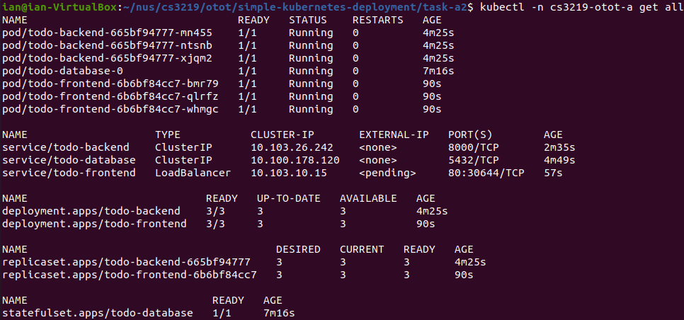

# Introduction to Kubernetes

A web application deployed using Kubernetes.

Created for CS3219 Software Engineering Principles and Patterns Own Time Own Target (OTOT) Task A2.

Note that this makes use of the Todo application created for OTOT Task B:
* Frontend: https://github.com/ianyong/todo-frontend
* Backend: https://github.com/ianyong/todo-backend

However, the images have been pre-built and pushed to GitHub's container registry for your convenience:
* Frontend: https://github.com/ianyong/simple-kubernetes-deployment/pkgs/container/todo-frontend
* Backend: https://github.com/ianyong/simple-kubernetes-deployment/pkgs/container/todo-backend

## Getting Started

1. Install Docker by following the instructions [here](https://docs.docker.com/engine/install/).
1. Install Docker Compose by following the instructions [here](https://docs.docker.com/compose/install/).
1. Install Kubernetes by following the instructions [here](https://kubernetes.io/releases/download/).
1. To run a Kubernetes cluster locally, you will need to install either [Docker Desktop](https://www.docker.com/products/docker-desktop) or [minikube](https://minikube.sigs.k8s.io/docs/start/).
   * Unfortunately, Docker Desktop is only available for Windows and macOS. As such, this task was developed using minikube.

## Running the Web Application

**Note: The order in which the Kubernetes configuration files is applied is important.**

1. Make a copy of `secrets.template.yml` as `secrets.yml`, then specify the `DB_USER` and `DB_PASSWORD`.
1. Create the `cs3219-otot-a` namespace. This is so as to ensure that all of the objects associated with this project are isolated from that of other projects.
   ```sh
   $ kubectl apply -f namespace.yml
   ```
1. Create the secrets that will be used in the deployments.
   ```sh
   $ kubectl apply -f secrets.yml
   ```
1. Create the database `StatefulSet`.
   ```sh
   $ kubectl apply -f db-statefulset.yml
   ```
1. Create the database `Service`.
   ```sh
   $ kubectl apply -f db-service.yml
   ```
1. Create the backend `Deployment`.
   ```sh
   $ kubectl apply -f backend-deployment.yml
   ```
1. Create the backend `Service`.
   ```sh
   $ kubectl apply -f backend-service.yml
   ```
1. Create the frontend `Deployment`.
   ```sh
   $ kubectl apply -f frontend-deployment.yml
   ```
1. Create the frontend `Service`.
   ```sh
   $ kubectl apply -f frontend-service.yml
   ```
1. At this point, the entire Kubernetes cluster has been set up. To check that everything is okay, run:
   ```sh
   $ kubectl -n cs3219-otot-a get all
   ```
   The output should look something like:
   <p align="center">
     
   </p>
1. In order to access the web application that is running in our Kubernetes cluster, we will forward the local port `3219` to port `80` on `service/todo-frontend`.
   ```sh
   $ kubectl -n cs3219-otot-a port-forward service/todo-frontend 3219:80
   ```
1. Navigate to http://localhost:3219 in a web browser to access the application.
