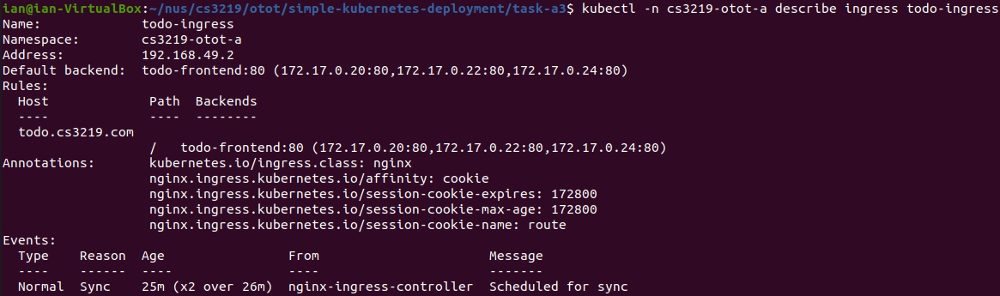
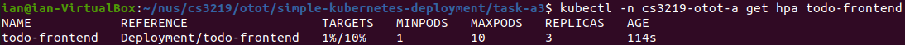
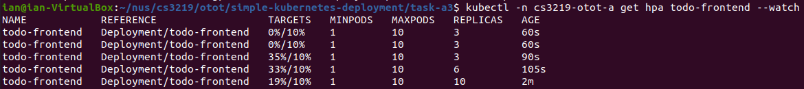

# Advanced Kubernetes Features

A web application deployed using Kubernetes with a load balancer and a horizontal pod auto-scaler.

Created for CS3219 Software Engineering Principles and Patterns Own Time Own Target (OTOT) Task A3.

Note that this makes use of the Todo application created for OTOT Task B:
* Frontend: https://github.com/ianyong/todo-frontend
* Backend: https://github.com/ianyong/todo-backend

However, the images have been pre-built and pushed to GitHub's container registry for your convenience:
* Frontend: https://github.com/ianyong/simple-kubernetes-deployment/pkgs/container/todo-frontend
* Backend: https://github.com/ianyong/simple-kubernetes-deployment/pkgs/container/todo-backend

## Getting Started

1. Follow the instructions in the [Getting Started](https://github.com/ianyong/simple-kubernetes-deployment/tree/master/task-a2#getting-started) and [Running the Web Application](https://github.com/ianyong/simple-kubernetes-deployment/tree/master/task-a2#running-the-web-application) sections of Task A2.

## Setting up Ingress Controller

**The instructions below continue on from where Task A2 left off.**

1. If you are using minikube, enable the NGINX ingress controller.
   ```sh
   minikube addons enable ingress
   ```
1. Update the frontend `Deployment` with a new value for `BASE_SERVER_URL`.
   ```sh
   kubectl apply -f frontend-deployment-updated.yml
   ```
1. Update the frontend `Service` type from `LoadBalancer` to `ClusterIP`. This is because the ingress controller will act as the load balancer as well as the entrypoint for all external requests.
   ```sh
   kubectl apply -f frontend-service-updated.yml
   ```
1. Create the ingress controller.
   ```sh
   kubectl apply -f ingress.yml
   ```
1. To verify that the ingress controller is working, run:
   ```sh
   kubectl -n cs3219-otot-a describe ingress todo-ingress
   ```
   The output should look something like:
   <p align="center">
     
   </p>
1. Note the value of `Address` returned in the command. (In the screenshot above, it is `192.168.49.2`.) Add a temporary mapping from the hostname `todo.cs3219.com` to the specified address in the hosts file which can be found at `/etc/hosts`.
1. Navigate to http://todo.cs3219.com in a web browser to access the application.

## Verifying Sticky Session Load Balancing

In order to verify that sticky sessions works, I added an endpoint to the backend at `/api/v1/hostname` which returns the name of the pod.
The following is the code in the handler that serves the endpoint:
```go
func GetHostName(r *http.Request, s *services.Services) (*api.Response, error) {
	hostname, err := os.Hostname()
	if err != nil {
		return nil, err
	}

	return &api.Response{
		Messages: api.StatusMessages{
			api.InformationMessage(hostname),
		},
		Code: http.StatusOK,
	}, nil
}
```

However, this only works if the ingress controller points directly to the backend.
In the normal set-up, all backend traffic is routed through the frontend pod.
As such, which backend pod serves the request can change.

1. In order to make use of the `/api/v1/hostname` endpoint to verify that sticky sessions are working, temporarily overwrite the ingress controller with one that points to the backend.
   ```sh
   kubectl apply -f ingress-backend.yml
   ```
1. Navigate to http://todo.cs3219.com/api/v1/hostname in a web browser or an API testing tool such as Postman.
1. Keep making calls to the `/api/v1/hostname` endpoint. The hostname displayed should remain the same throughout.
1. Now, delete the cookie from your browser's storage and make another call to the endpoint. Since we have 3 replicas of the backend, there is a 66% chance that the hostname will change.

## Setting up Horizontal Pod Auto-scaler

**If you overwrote the original ingress controller in order to verify that sticky sessions works, please re-apply the original ingress controller.**
```sh
kubectl apply -f ingress.yml
```

1. Enable the metrics server.
   ```sh
   kubectl apply -f metrics-server.yml
   ```
1. Create the horizontal pod auto-scaler.
   ```sh
   kubectl apply -f horizontal-pod-autoscaler.yml
   ```
1. To verify that the auto-scaler is working, run:
   ```sh
   kubectl -n cs3219-otot-a get hpa todo-frontend
   ```
   The output should look something like:
   <p align="center">
     
   </p>

## Verifying Horizontal Pod Auto-Scaling

1. Start watching the load of the auto-scaler.
   ```sh
   kubectl -n cs3219-otot-a get hpa todo-frontend --watch
   ```
1. In order to see how the auto-scaler reacts to increasing load, we will send an infinite loop of requests to the application in another terminal.
   ```sh
   while true; do curl --silent todo.cs3219.com > /dev/null; done
   ```
1. The auto-scaler will automatically resize the deployment. For example:
   <p align="center">
     
   </p>
